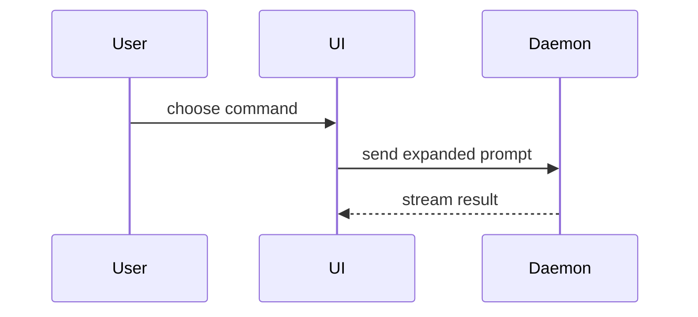

> **Mirror notice:** This skill is mirrored from [mattpocock/skills · skills/engineering/pr](https://github.com/mattpocock/skills/tree/main/skills/engineering/pr) (built from upstream commit `d72129d`, MIT License — see the License section at the end of this file). 由 SkillHub 社区搬运,非作者官方维护;更新与反馈请见上游仓库。此镜像由 @jaredshuai 维护。

Use this template for writing the PR body:

```markdown
## Summary

<diagram, diff-sketch, or tree>

## Evidence

- **Before:** <screenshot/output/failing test run>
  **After:** <screenshot/output/passing test run>

## Merge Danger

**Door:** <one-way or two-way>

<optional: description>

**Blast Radius:** <one-word description>

<optional: potential ramifications of merge>
```

## Sections

Skip all preambles and keep prose brief. Use the user's domain language from `GLOSSARY.md`.

### Summary

Pick the smallest view that makes the key point clear.

- Show logic or an algorithm as pseudocode:

```text
on(save)
  if content is unchanged
    return cached result
  write new content
  return fresh result
```

- Show runtime control flow as a call tree:

```text
submitForm
  createSession
    persistPrompt
    launchAgent
  navigateToSession
```

- Show UI structure as a component tree, including state and module boundaries that matter:

```text
<SessionPage> (apps/example/src/routes/session.tsx)
  useSessionEvents()
  <SessionToolbar>
    <RunSkillButton> (packages/ui)
```

- Show file responsibility or a broad refactor as a shallow file tree:

```text
src/
├── commands/       # parses user actions
├── sessions/       # owns session state
└── transport/      # sends API requests
```

- Show component interaction, control flow, or data flow with Mermaid:



- Use `diff` when the point is what changes and the surrounding shape already exists. Match the diff shape to the topic.

For a component change:

```diff
 <SessionPage>
   useSessionEvents()
   <SessionToolbar>
+    <RunSkillButton />
   <SessionTimeline>
+    <SkillResultCard />
```

For a file-layout change:

```diff
 src/
 ├── commands/
+│   └── show-me.ts       # expands the slash command
 ├── sessions/
-└── transport.ts
+└── transport/
+    ├── client.ts
+    └── stream.ts
```

For a call-tree or call-stack change:

```diff
 submitForm
   createSession
     persistPrompt
+    expandSkillMention
     launchAgent
-  navigateToSession
+  navigateToSession
+    subscribeToEvents
```

For a state or control-flow change:

```diff
 on(save)
-  write content
+  if content is unchanged
+    return cached result
+  write new content
+  invalidate cache
```

- Show the whole block when most of it is new, when omitted context would hide ownership or order, or when the user needs a copyable target shape:

```ts
function expandSkill(command: string): string {
  const skillName = command.slice(1);
  return `use the ${skillName} skill`;
}
```

#### Guidance

Place each visual next to the short text it supports. Keep only the calls, files, props, states, and boundaries needed to answer the user's current question or the options to resolve the current discussion point.

You may use one of these, you may use several, it is unlikely you will use all of them. Use your judgement and don't overwhelm the user.

### Evidence

Concrete evidence that the change works. Show a before and after.

Screenshots are S-tier - when the environment is set up for it and the change is visual.

Execution-based evidence is A-tier. Test results, console output. Show the exact test that now fails and passes, using pseudocode.

### Merge Danger

Describe whether it's a one-way or two-way door. You can walk back through two-way doors, but not one-way doors. A PR that is cheap to roll back is lower risk. Changes that involve destructive actions or hard-to-reverse decisions are one-way doors.

The blast radius is the potential impact or scope of the changes introduced by this PR. Consider all possibilities. Examples are layout shift, breakages for consumers, mobile responsiveness, etc.

---

## License

MIT License

Copyright (c) 2026 Matt Pocock

Permission is hereby granted, free of charge, to any person obtaining a copy
of this software and associated documentation files (the "Software"), to deal
in the Software without restriction, including without limitation the rights
to use, copy, modify, merge, publish, distribute, sublicense, and/or sell
copies of the Software, and to permit persons to whom the Software is
furnished to do so, subject to the following conditions:

The above copyright notice and this permission notice shall be included in all
copies or substantial portions of the Software.

THE SOFTWARE IS PROVIDED "AS IS", WITHOUT WARRANTY OF ANY KIND, EXPRESS OR
IMPLIED, INCLUDING BUT NOT LIMITED TO THE WARRANTIES OF MERCHANTABILITY,
FITNESS FOR A PARTICULAR PURPOSE AND NONINFRINGEMENT. IN NO EVENT SHALL THE
AUTHORS OR COPYRIGHT HOLDERS BE LIABLE FOR ANY CLAIM, DAMAGES OR OTHER
LIABILITY, WHETHER IN AN ACTION OF CONTRACT, TORT OR OTHERWISE, ARISING FROM,
OUT OF OR IN CONNECTION WITH THE SOFTWARE OR THE USE OR OTHER DEALINGS IN THE
SOFTWARE.
